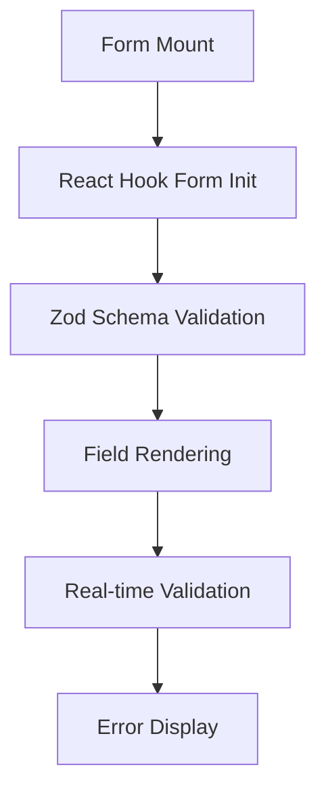
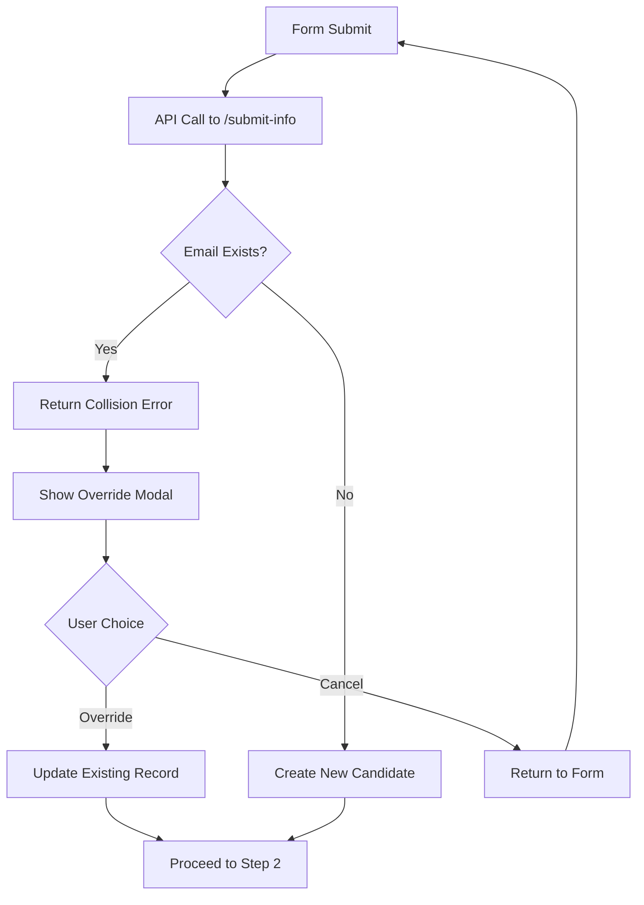
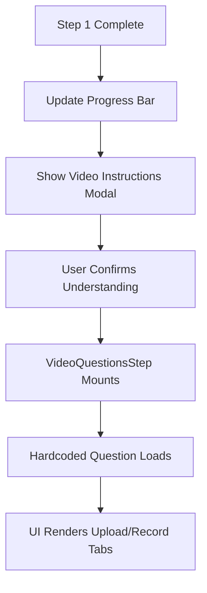
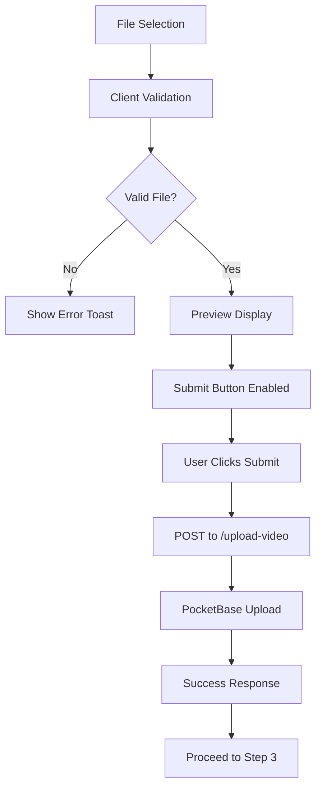
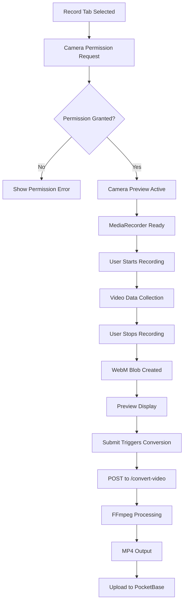
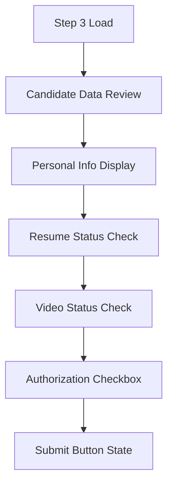
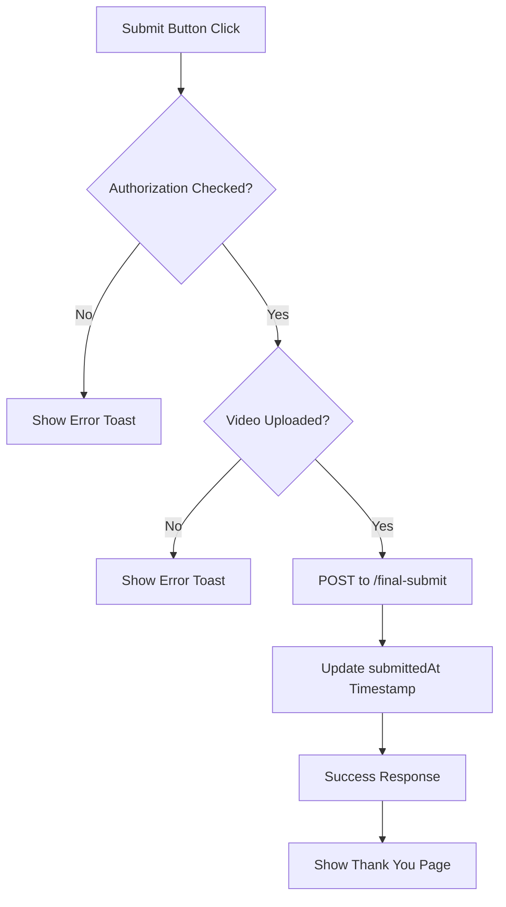
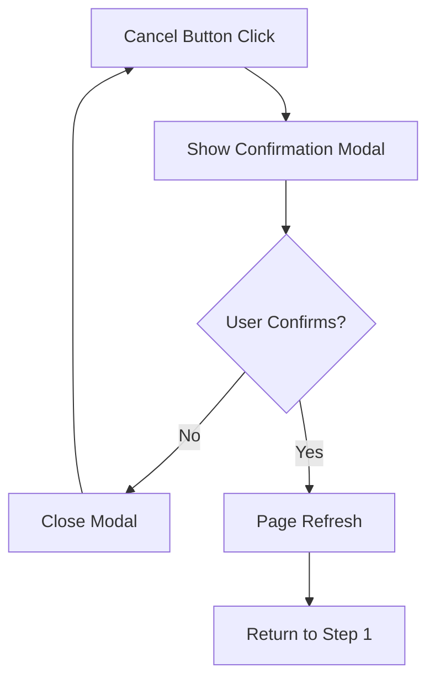
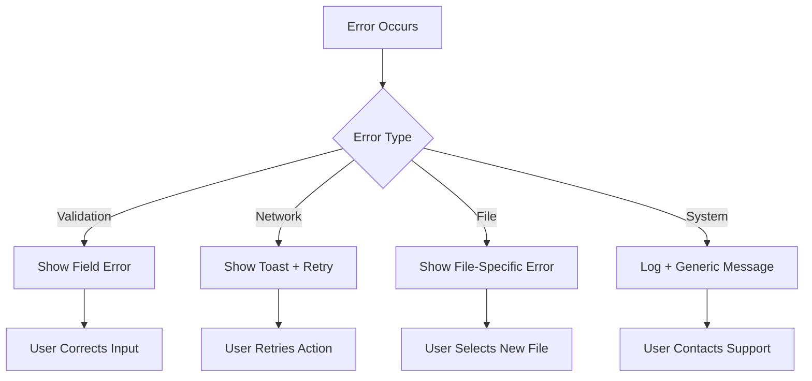

# DevOn Interview Portal - Technical Flow Documentation

## Project Idea & Business Purpose

### Business Objective
The DevOn Interview Portal is a streamlined candidate assessment platform designed to collect candidate information, resumes, and video responses efficiently. It replaces traditional multi-step interview processes with a single, comprehensive digital submission system.

### Target Users
- **Candidates**: Job applicants submitting their information and video responses
- **Recruiters**: HR teams reviewing candidate submissions
- **Administrators**: System managers handling candidate data

### Business Value
- **Efficiency**: Reduces manual interview scheduling and initial screening time
- **Consistency**: Standardized question format ensures fair evaluation
- **Scalability**: Can handle multiple candidates simultaneously
- **Documentation**: Complete digital record of candidate submissions
- **Accessibility**: 24/7 availability for candidate submissions

## Technical Architecture Overview

### System Architecture
```
┌─────────────────┐    ┌─────────────────┐    ┌─────────────────┐
│   Frontend      │    │   API Layer     │    │   Backend       │
│   (Next.js)     │◄──►│   (Next.js)     │◄──►│   (PocketBase)  │
│                 │    │   Routes        │    │   Database      │
└─────────────────┘    └─────────────────┘    └─────────────────┘
```

### Data Flow Architecture
```
User Input → Form Validation → API Processing → Database Storage → Response → UI Update
```

## Detailed Technical Flow

### Phase 1: Application Initialization

#### 1.1 Application Bootstrap
1. **Next.js App Router** loads the main page (`src/app/page.tsx`)
2. **InterviewPortal component** initializes with default state
3. **Header component** renders with DevOn branding
4. **Progress bar** displays Step 1 as active
5. **BasicInfoStep component** mounts and renders form fields

#### 1.2 Environment Setup
1. PocketBase connection established via environment variables
2. Client-side validation schemas loaded (Zod)
3. UI components initialize with Shadcn/Radix primitives
4. Toast notification system ready (Sonner)

### Phase 2: Step 1 - Basic Information Collection

#### 2.1 Form Rendering & Validation


**Technical Process**:
1. **Form Initialization**:
   - React Hook Form creates form context
   - Zod validation schema applies to all fields
   - Field watchers establish real-time validation

2. **Field Validation Logic**:
   ```typescript
   // Name validation
   name: z.string().min(1, "Name is required")
   
   // Email validation  
   email: z.string().email("Please enter a valid email")
   
   // Mobile validation
   mobile: z.string().regex(/^\d{10}$/, "Please enter a valid 10-digit mobile number")
   ```

3. **Resume Upload Processing**:
   - File type validation (PDF, DOCX)
   - Size validation (max 5MB)
   - Preview generation for user confirmation
   - FormData preparation for API submission

#### 2.2 Email Collision Handling


**Technical Implementation**:
1. **Initial Submission**: POST to `/api/submit-info`
2. **Collision Detection**: PocketBase query by email
3. **Modal Display**: Blur backdrop modal with override option
4. **Override Process**: UPDATE operation instead of CREATE
5. **State Transition**: Move to Step 2 with candidate data

#### 2.3 Disabled Button Interaction
**Enhanced UX Flow**:
1. **Button State Detection**: Form validation errors or missing files
2. **Click Handler**: Prevents submission, triggers field highlighting
3. **Field Highlighting**: Red borders, pulse animation, error messages
4. **Auto-scroll**: Focuses first problematic field
5. **Auto-recovery**: Highlighting fades after 3 seconds

### Phase 3: Step 2 - Video Response Collection

#### 3.1 Step Transition & Question Loading


**Technical Process**:
1. **Progress Update**: Step 2 becomes active with #327eb4 color
2. **Modal Display**: Video instructions with blur backdrop, no close button
3. **Question Initialization**: Hardcoded question object created
4. **UI Rendering**: Tabs for Upload/Record with consistent styling

#### 3.2 Video Upload Flow


**Technical Implementation**:
1. **File Validation**:
   - Type checking: MP4, MOV, WebM accepted
   - Size validation: 30MB maximum
   - Client-side preview generation

2. **Upload Processing**:
   - FormData creation with video file
   - API call to `/api/upload-video`
   - PocketBase file storage integration
   - Candidate record update with video field

#### 3.3 Video Recording Flow


**Technical Implementation**:
1. **Camera Setup**:
   ```typescript
   navigator.mediaDevices.getUserMedia({ 
     video: true, 
     audio: true 
   })
   ```

2. **Recording Process**:
   - MediaRecorder API with WebM output
   - Real-time blob data collection
   - Preview generation from blob URL

3. **Conversion Pipeline**:
   - WebM blob sent to `/api/convert-video`
   - Server-side FFmpeg processing
   - Optimized MP4 output for PocketBase compatibility
   - Temporary file cleanup

#### 3.4 Submit Button Interaction
**Disabled State Handling**:
1. **State Detection**: No video uploaded or recorded
2. **Visual Feedback**: Button appears disabled with opacity
3. **Click Action**: Highlights upload area with red styling
4. **Tab Switching**: Auto-switches to upload tab if on record
5. **User Guidance**: Clear messaging about missing requirements

### Phase 4: Step 3 - Final Review & Submission

#### 4.1 Application Summary Display


**Technical Process**:
1. **Data Aggregation**: Collect all submitted information
2. **Status Verification**: Check completion of all required fields
3. **UI Rendering**: Summary cards with status indicators
4. **Authorization**: Required checkbox for legal compliance

#### 4.2 Final Submission Process


**Technical Implementation**:
1. **Validation Checks**:
   - Authorization checkbox state
   - Video upload confirmation
   - Complete candidate record verification

2. **Finalization Process**:
   - API call to `/api/final-submit`
   - Database timestamp update
   - Success confirmation display

#### 4.3 Cancel & Start Over Flow


## API Endpoint Technical Flow

### POST /api/submit-info
**Purpose**: Handle basic information and resume submission

**Flow**:
1. Parse multipart form data
2. Validate file types and sizes
3. Check email collision in PocketBase
4. Handle collision with appropriate response
5. Create or update candidate record
6. Upload resume file to PocketBase
7. Return candidate data or error

### POST /api/upload-video  
**Purpose**: Handle video file uploads

**Flow**:
1. Parse multipart form data with video file
2. Validate video file (type, size, format)
3. Upload to PocketBase file storage
4. Update candidate record with video field reference
5. Return success confirmation

### POST /api/convert-video
**Purpose**: Convert WebM recordings to MP4 format

**Flow**:
1. Receive WebM blob from frontend
2. Create temporary input file
3. Execute FFmpeg conversion with optimized parameters
4. Generate MP4 output file
5. Return converted blob to frontend
6. Clean up temporary files

### POST /api/final-submit
**Purpose**: Finalize application submission

**Flow**:
1. Validate candidate ID
2. Update candidate record with submittedAt timestamp
3. Perform final validation checks
4. Return success confirmation
5. Trigger any post-submission processes

## State Management Flow

### Global State (InterviewPortal)
```typescript
interface InterviewState {
  currentStep: number;           // 1, 2, or 3
  candidate: Candidate | null;   // User data
  questions: Question[];         // Hardcoded question
  completedQuestions: Set<string>; // Completion tracking
}
```

**State Transitions**:
- Step 1 → Step 2: After successful info submission
- Step 2 → Step 3: After video upload completion
- Step 3 → Complete: After final submission
- Any Step → Step 1: Via cancel & restart

### Component State Management
- **Form State**: React Hook Form manages input values and validation
- **Upload State**: Local component state for file handling
- **UI State**: Loading, processing, error states per component
- **Modal State**: Visibility and interaction state for modals

## Error Handling & Recovery Flow

### User-Facing Errors
1. **Validation Errors**: Real-time field validation with clear messaging
2. **Network Errors**: Toast notifications with retry options
3. **File Errors**: Specific guidance for file type/size issues
4. **Process Errors**: Step-by-step recovery instructions

### System Error Flow


## Performance & Optimization Flow

### Frontend Optimizations
- **Component Rendering**: Efficient re-renders with React best practices
- **File Handling**: Streaming uploads for large files
- **State Updates**: Minimal state changes for optimal performance
- **Bundle Size**: Tree shaking and code splitting where beneficial

### Backend Optimizations
- **Database Queries**: Optimized PocketBase operations
- **File Processing**: Efficient FFmpeg parameters for video conversion
- **Memory Management**: Proper cleanup of temporary files and streams
- **Caching**: Strategic caching of static resources

This technical flow documentation provides comprehensive understanding of the system's functionality, enabling product owners and architects to make informed decisions about features, scalability, and maintenance.